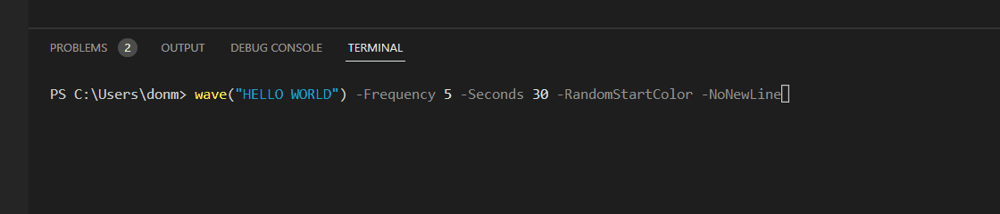

# Introduction 
This is a little module I made for fun. 

THIS MODULE IS CURRENTLY IN BETA

# Getting Started
After sourcing the module, just run "Write-RgbHost <text>"

Beta version: For now, just use the "wave" function directly. e.g.
wave("HELLO WORLD") -Frequency 5 -Seconds 30 -RandomStartColor -NoNewLine

# Coming Soon
TODO: 
- Add strobe mode
- Add/test support for arrays of strings and more complex objects

# Contribute
If you want to contribute: Add MOAR RGB!